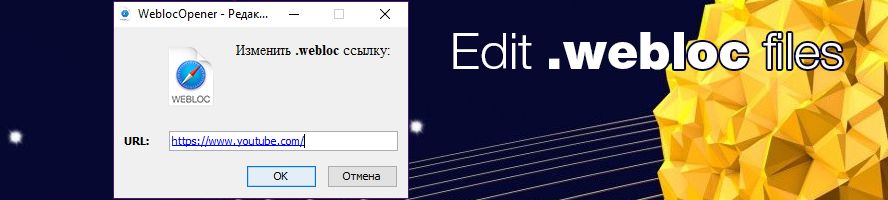
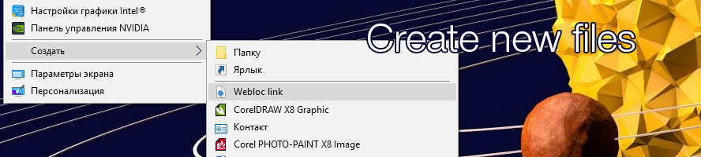
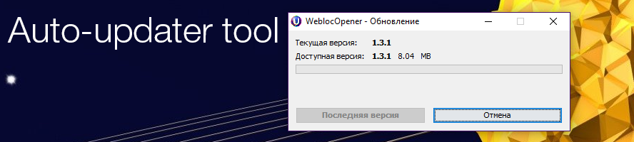

# WeblocOpener

Visit website: [https://benchdoos.github.io/](https://benchdoos.github.io/)

Download [Latest version](https://github.com/benchdoos/WeblocOpener/releases/latest)

## Introduction:
WeblocOpener is a simple way to open, edit, create MacOS Safari `.webloc` files on Windows.

## Features

- Get full access to `.webloc` files on Windows: open, edit and create.
- Created files does not differ from MacOS original files.
- Easy to install and easy to use.
- Easy to update with auto-update app. 
Updater will help you to find out when new version is available, download and install the update.

## What is `.webloc` file?
`.webloc` extension is usually means that in front of you is a MacOS Safari web-url. 
Actually it is a text document, formated to property list - PLIST 1.0 
([see](https://developer.apple.com/library/content/documentation/General/Reference/InfoPlistKeyReference/Articles/AboutInformationPropertyListFiles.html)).
You can open it with any text-editor (like notepad on Windows) to find out the url, saved in `.webloc` file.
But if you need to open a big number of files or open them often - using text-editor wouldn't be the fastest and the easiest solution.
So that's why this application was created - for these users.

## What can WeblocOpener do?

- Open  MacOS Safari .webloc link on Windows on your default browser 
- Create new .webloc files 
- Edit created files 
- Auto-paste URL from clipboard when you created a new file 
- Auto-update tool will help you receive new updates just from the server 

## Have questions? 
Watch [Youtube](https://youtu.be/Z-bT-VWMDsQ) video

## System Requirements
<ul class="SystemRequirements">
    <b>Operating system:</b>
    <li>Windows XP, Vista, 7, 8, 10</li>
    <b>CPU:</b>
    <li>Pentium 2 266MHz or better</li>
    <b>Memory:</b>
    <li>128 MB RAM</li>
    <b>Hard drive:</b>
    <li>25 MB free hard disk space</li>
     
    <b>Additional software:</b>
<li>Java 8 required - <a href="https://java.com/download/">Download</a></li>
</ul>

## Download:
Windows:

[Latest version](https://github.com/benchdoos/WeblocOpener/releases/latest) v1.3.1
