

# WeblocOpener

Visit website: [https://benchdoos.github.io/](https://vk.cc/6wK76Z)

Follow on Twitter: [https://twitter.com/weblocopener](https://twitter.com/weblocopener)

Subscribe on telegram [channel](https://vk.cc/6wK7k1)

Download [Latest version](https://vk.cc/7Flxoe)

## Introduction:
WeblocOpener is a simple way to open, edit, create MacOS Safari `.webloc` files on Windows and Debian GNU/Linux.

## What is `.webloc` file?
`.webloc` extension is usually means that in front of you is a MacOS Safari web-url. 
Actually it is a text document, formatted to property list - PLIST 1.0 
([see](https://developer.apple.com/library/content/documentation/General/Reference/InfoPlistKeyReference/Articles/AboutInformationPropertyListFiles.html)).
You can open it with any text-editor (like notepad on Windows or gedit on Ubuntu) to find out the url, saved in `.webloc` file.
But if you need to open a big number of files or open them often - using text-editor wouldn't be the fastest and the easiest solution.
So that's why this application was created - for these users.

## What can WeblocOpener do?

**WeblocOpener gives full MacOs `.webloc` files support on Windows and Debian GNU/Linux.**
[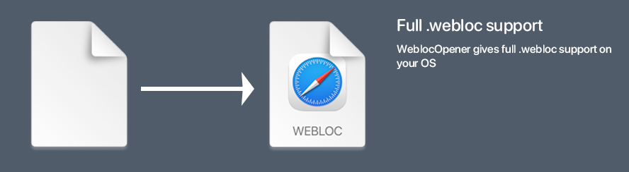](#what-can-weblocopener-do)

**Open `.webloc`, `.desktop`, `.url`, `.webarchive` files.** 
[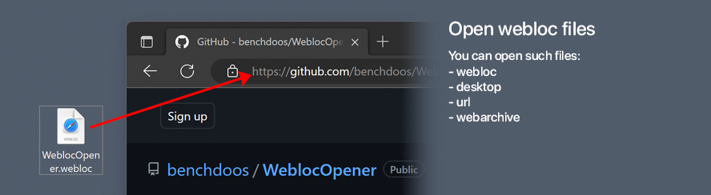](#what-can-weblocopener-do)

**Choose whatever browser you want. Open in browser from preset or use custom. 
Browsers in preset: Google Chrome (Chromium project), Opera, Microsoft Edge, Mozilla Firefox and more...  or you can use your custom browser.**
[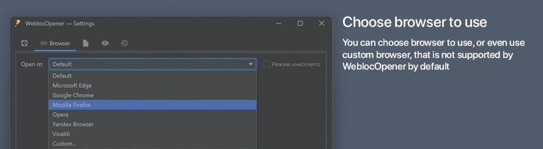](#what-can-weblocopener-do)

**WeblocOpener provides multiple abilities to operate with supported formats.**
[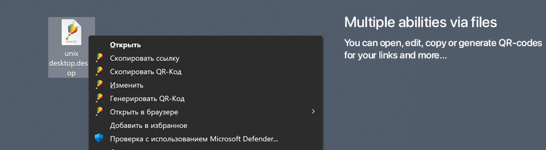](#what-can-weblocopener-do)

**Convert `.webloc` to `.url` to `.desktop` and backward by using drag and drop on settings window. 
Also, you can convert `.webarchive` files into `.html` webpages.** 
[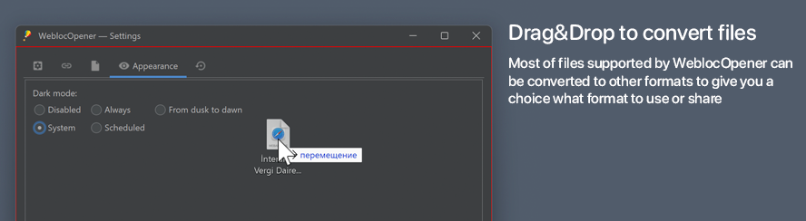](#what-can-weblocopener-do)

**Create new `.webloc` files. Created files are fully supported by Safari on MacOS and WeblocOpener on Windows or Unix.** 
[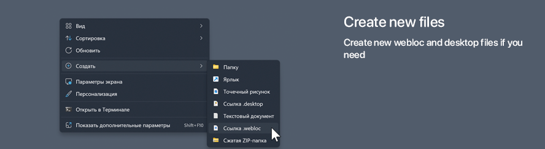](#what-can-weblocopener-do)

**Edit existed files. Change links when you need it.**
[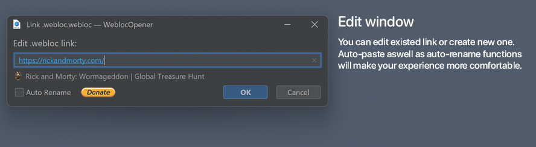](#what-can-weblocopener-do)

**Dark mode will protect your eyes at night. It turns on automatically scheduled or by your location. Check out in settings how to customize it for yourself.** 
[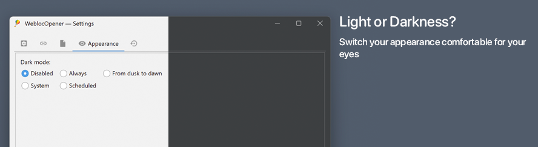](#what-can-weblocopener-do)

**Settings window can not only change settings of application, but also convert files.** 
[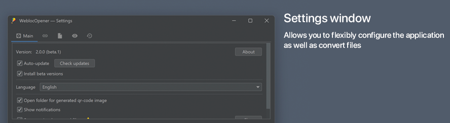](#what-can-weblocopener-do)

**WeblocOpener can open and convert `.webarchive` files.**

**You can generate QR-Code for stored link to open in on your smartphone.**
[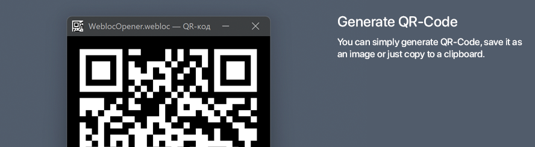](#what-can-weblocopener-do)

**When there will appear new features - auto-updater tool can notify you.**
[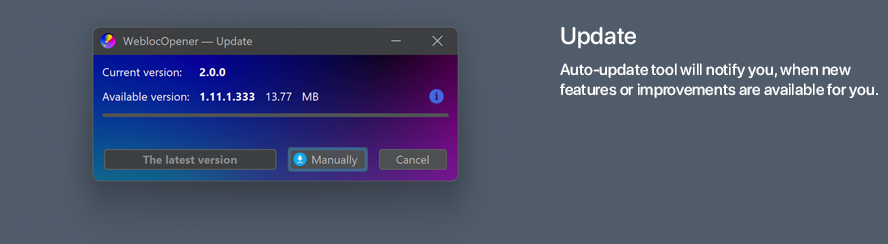](#what-can-weblocopener-do)

## Supported features

| Feature                                              | Windows | Unix |    MacOS    |
|------------------------------------------------------|:-------:|-----:|:-----------:|
| Open                                                 |   Yes   |  Yes | Coming soon |
| Edit                                                 |   Yes   |  Yes | Coming soon |
| Create new                                           |   Yes   |  Yes | Coming soon |
| Generate QR-Code                                     |   Yes   |  Yes | Coming soon |
| Instant URL, QR-Code copy                            |   Yes   |  Yes | Coming soon |
| Convert `.webloc`, `.url`, `.desktop`, `.webarchive` |   Yes   |  Yes | Coming soon |
| Auto-update                                          |   Yes   |  Yes | Coming soon |
| Open in not default browser                          |   Yes   |  Yes | Coming soon |
| Switch browser to open for each file                 |   Yes   |   No | Coming soon |

## Have questions? 
**Watch the youtube video, with new abilities of version 1.4:**
[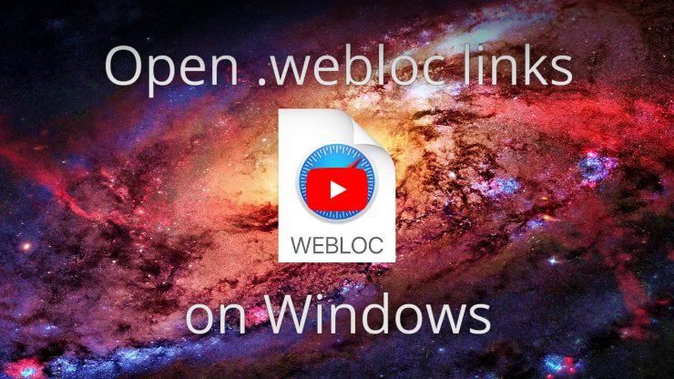](https://vk.cc/73qFIF)

## System Requirements
<ul class="SystemRequirements">
    <b>Operating system:</b>
    <li>7, 8, 10, 11 / Debian GNU/Linux (Ubuntu, etc...)</li>
    <b>Hard drive:</b>
    <li>25 MB free hard disk space</li>
     
    <b>Additional software:</b>
<li>Java 17 required - <a href="https://adoptium.net/marketplace/">Download</a></li>
</ul>
